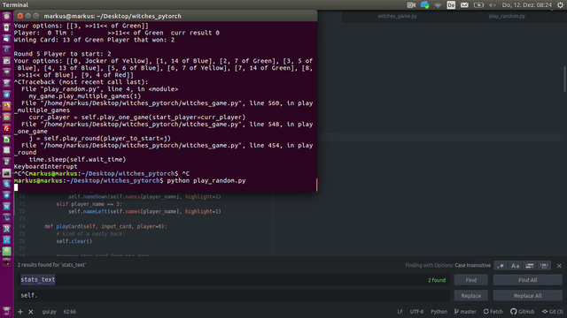

## Rules:
*	60 	   Cards(4xJoker, 1-14 in Yellow, Green, Red, Blue)
*	Red    Cards give -1 Point (except Red 11)
*	Blue   Cards do nothing    (except Blue 11 if you have it in your offhand deletes all Green -Points)
*	Green  Cards			   (except Green 11 -5 and Green 12 -10 Points)
* 	Yellow Cards do nothing    (except Yellow 11 +5)
*	A joker can be placed anytime otherwise you have to give the same color as the first player
*	Aim:	Have a minimum of minus Points!
* 	Note: Number 15 is a Joker

## Run code:
* necessary is >=python3.5
* Train the agent: ```python Agent.py```
* Play random    : ```python play_random.py```

## Pygame Example:


## DQN Representation
### Inputs:
As binary (a vector of 180 bool)
* 60 card x is currently on the table
* 60 card x is in the ai hand
* 60 card x is already been played

### Outputs:
*    If the ai is the first player of a round it can play any card
*    If the ai is not first player it has to respect the first played card (or play a wizzard)
This means there is actually a list of available options. I then sort this list and have 60 Output bools which I set to 1 if this option is possible. Among these options the ai should then decide what the correct option is.

### Inconsistent Action Space
As explained [here](https://ai.stackexchange.com/questions/9491/inconsistent-action-space-in-reinforcement-learning) this card game has an inconsistent action space (for different states the action set has a different size). E.g. snake has a discrete action space. You always have 3 actions (Right, Left, Straight). One reason why it is very difficult to solve card games using DQN is that these require one output node for every action, which means you have to enumerate all actions. Similar policy gradient traditionally also require one output node per action, which again means you have to be able to enumerate all the actions in advance (when determining the network architecture).
However [here](https://discuss.pytorch.org/t/how-to-implement-action-sampling-for-differing-allowed-actions/14481) it is said that for Policy Gradient method: By setting the forbidden actions probabilities to zero, your agent will only explore the allowed ones and learn what is the best action out of the allowed set.

## TODO:
* respect: [evaluating the value of the state after the action with your neural network instead of the value of a action](https://ai.stackexchange.com/questions/16999/dqn-card-game-how-to-represent-the-actions)
* Have a look into: [github_rlcards](https://github.com/datamllab/rlcard) and [this paper](https://arxiv.org/abs/1910.04376)
* Have a look to    [uno](https://github.com/datamllab/rlcard/blob/master/examples/uno_dqn.py)

## Stats for AI
* Currently the train_long_memory does not work at all nevertheless, the ai player seems to learn something:
* 


## Stats (random playing):
* For 4 Players, played 50.000 Rounds
* If Player 0 has to start and plays a random card he will have a minus of -6.025 for each game
* Not Player 0  random	-5.85 each game
* Not Player 0  mini	    -5.80 each game
