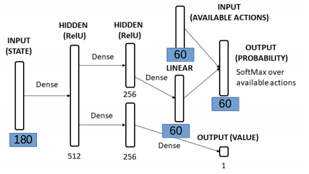

## Rules:
*	60 	   Cards(4xJoker, 1-14 in Yellow, Green, Red, Blue)
*	Red    Cards give -1 Point (except Red 11)
*	Blue   Cards do nothing    (except Blue 11 if you have it in your offhand deletes all Green -Points)
*	Green  Cards			   (except Green 11 -5 and Green 12 -10 Points)
* 	Yellow Cards do nothing    (except Yellow 11 +5)
*	A joker can be placed anytime otherwise you have to give the same color as the first player
*	Aim:	Have a minimum of minus Points!
* 	Note: Number 15 is a Joker

## Run code:
* necessary is >=python3.5
* Train the agent: ```python Agent.py```
* Play random    : ```python play_random.py```

## Pygame Example:


## DQN Representation
### Inputs:
As binary (a vector of 180 bool)
* 60 card x is currently on the table
* 60 card x is in the ai hand
* 60 card x is already been played

### Outputs:
*    If the ai is the first player of a round it can play any card
*    If the ai is not first player it has to respect the first played card (or play a wizzard)
This means there is actually a list of available options. I then sort this list and have 60 Output bools which I set to 1 if this option is possible. Among these options the ai should then decide what the correct option is.

### Inconsistent Action Space
As explained [here](https://ai.stackexchange.com/questions/9491/inconsistent-action-space-in-reinforcement-learning) this card game has an inconsistent action space (for different states the action set has a different size). E.g. snake has a discrete action space. You always have 3 actions (Right, Left, Straight). One reason why it is very difficult to solve card games using DQN is that these require one output node for every action, which means you have to enumerate all actions. Similar policy gradient traditionally also require one output node per action, which again means you have to be able to enumerate all the actions in advance (when determining the network architecture).
However [here](https://discuss.pytorch.org/t/how-to-implement-action-sampling-for-differing-allowed-actions/14481) it is said that for Policy Gradient method: By setting the forbidden actions probabilities to zero, your agent will only explore the allowed ones and learn what is the best action out of the allowed set.

## TODO:
* respect: [evaluating the value of the state after the action with your neural network instead of the value of a action](https://ai.stackexchange.com/questions/16999/dqn-card-game-how-to-represent-the-actions)
* Have a look into: [github_rlcards](https://github.com/datamllab/rlcard) and [this paper](https://arxiv.org/abs/1910.04376)
* Have a look to    [uno](https://github.com/datamllab/rlcard/blob/master/examples/uno_dqn.py)
* Have a look into Big 2 solved by PPO uses TF [here](https://github.com/henrycharlesworth/big2_PPOalgorithm)
* Have a look into Belot solved by Policy Gradient using Pytorch [here](https://github.com/bornabesic/belot/blob/master/players/PlayerRL/policy.py)
* Have a look into Durak A2C with Keras [here] (https://github.com/janEbert/rldurak/blob/master/thesis/rldurak.pdf)

## Stats for AI
* Currently the train_long_memory does not work at all nevertheless, the ai player seems to learn something:
* 


## Stats (random playing):
* For 4 Players, played 50.000 Rounds
* If Player 0 has to start and plays a random card he will have a minus of -6.025 for each game
* Not Player 0  random	-5.85 each game
* Not Player 0  mini	    -5.80 each game


## PPO Algorithm
trying to adapt [Big2] for witches (https://github.com/henrycharlesworth/big2_PPOalgorithm)

use python 3.5.2, tf, stable-baselines(pip install stable-baselines)
baselines is not used cause of mujo license!

Start with:
python mainBig2PPOSimulation.py (using python Python 3.5.2)

See Folder: **PPO**

* *PPONetwork.py*:
	+ Inputs:  180x1 bools: (60: Cards of ai, 60: Card has been played, 60: Card is on table)
	+ Outputs: 60x1  bools: (0....1...0 sorted index of available actions)
	+ 

* *generateGUI.py*
	+ (TODO) Generates the GUI

* *gameClasses.py*
	+ Contains class **card**
	+ Contains class **deck**
		- shuffle()
	+ Contains class **player**:
		- getOptions() -> get the actions of a player in cards sorted as BGRY
		- getBinaryOptions(incolor) -> get the sorted actions of this player in 0....1 (60x1), if incolor==None a joker was played before! if incolor==Color you have limited options! (except you have a joker)
		- getBinaryHand() -> get the state in 0...1 of the cards on hand of this player
		- optional: getOffHandState() -> get the state in 0...1 of the played cards of one player
		- playBinaryCardIndex(idx): input the index of the card you want to play!
		- playRandomCard(incolor):  plays a random card that is possible!
	+ Contains class **game**
		+ each player is considered as ai player (4 neuronal networks are constructed!)
		+ Methods:
			- getCurrentState(playeridx): construct with getPlayedCardsState, getTableState, getOnHandState()
			- getCardIndex()
			- step(player_idx, action_idx)
			- evaluateWinner() # uses on_table_cards to evaluate the winner
			- getInColor()    # returns the leading color, if 4 joker played, none is returned.
			- getPreviousPlayer() # returns prev player
			- getNextPlayer(): # returns the index of the next player and sets the active player to the nextPlayer
			- assignRewards(winner_idx)
			- getState() #return active player, nn of active player and actions of active player
			- reset():
			- fillNeuralNetworkHand(player): fills the neuronal Network Input (180x1) depending on the cards of the player
			- updateNeuralNetworkInputs(prevHand, cPlayer): (do I need this method at all?)
			- updateGame()
			- assignRewards(): assigns the rewards self.rewards to each player !
			- step()
			- returnAvailableActions() -> getHandActions(card_list)
